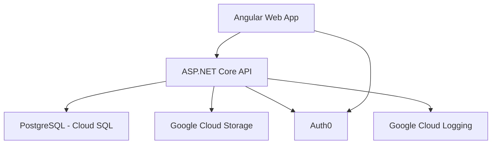

# Proprietary ERP Solution (Defunct)

A web-based ERP system for a non-profit organization in Afghanistan, managing Accounting, HR, Inventory, and Project Management for over 1,000 users.

## My Contributions

As CTO at EdgSolutions, I led development and optimization efforts:

- Designed a scalable microservices architecture using ASP.NET Core and Angular.
- Implemented a CI/CD pipeline with GitLab CI, reducing deployment times by 90%.
- Optimized API performance by 30% and enhanced system stability through code refactoring.
- Created Helm charts for Kubernetes deployments on Google Cloud Platform.
- Specified and enforced standards for managing product development and traceable communications between all stakeholders.

> This architecture was in the middle of migration towards Clean Architecture when the project had to be shut down. See [here](https://github.com/spiceFlowMatrix/BridgeTrunk) for the WIP migration.

## DevOps Highlights

> **Note:** This project relied on several services from Google Cloud Platform and Auth0, so a live demo isn’t available. The repository includes CI/CD configurations, Helm chart, and Dockerfiles used in production.

- [`.gitlab-ci.yml`](./.gitlab-ci.yml): Automated build and deployment for multiple environments.
- [Dockerfile](./Dockerfile): Containerized API and web app (built in [`.gitlab-ci.yml`](./.gitlab-ci.yml)) for consistent environments.
- [Helm Chart](./k8s-chart/Chart.yaml): Managed Kubernetes deployments on GKE.

## Tech Stack

- **Backend:** ASP.NET Core (REST API)
- **Web Frontend:** Angular
- **Database:** PostgreSQL
- **CI/CD:** GitLab, Docker, Kubernetes, Helm
- **Cloud:** Google Cloud Platform

## Architecture

<!-- # Home

This is the home page for all documentation related to this project. This documentation will provide the development team specifications against which they can develop all functionality for the application. The same specifications can be used by QA to ensure functionality is implemented as per specification. Furthermore, this can be used as guides for end-users and testers alike to find their way around how everything works. Most importantly, this serves as a single source of truth for what the application is and does.

This application provides services and functionality that can address a wide range of business use cases.

 -->
