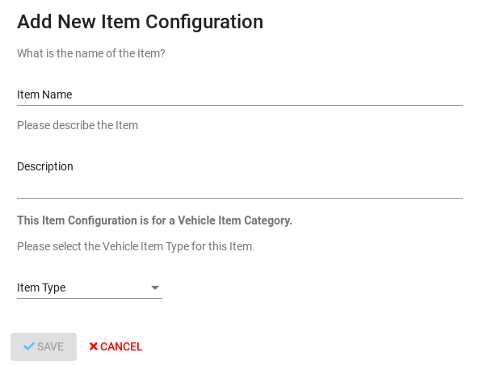

# Holidays

## Toolbar

1. Select Office
2. Setting Weekly Holidays

This is where you can set holidays by selecting the month and then clicking the set weekly holidays button. Doing this will navigate you to the weekly holidays form where you will be required to select weekly.

This is how the form looks like.

