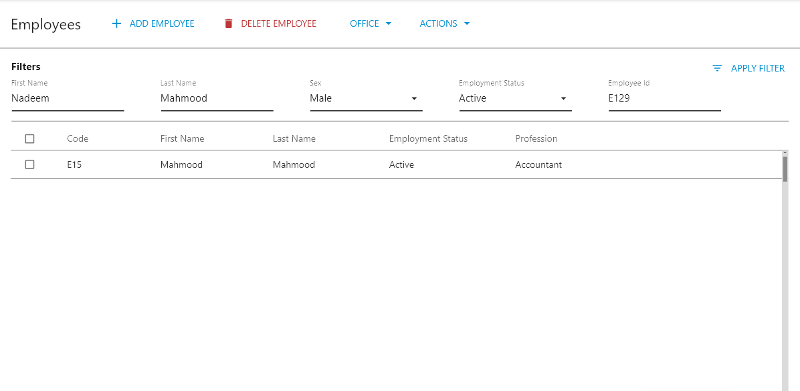

# HRM Resources Control Panel

## Overview

The application provides the following functionality that handles HR management panel:

1. Toolbar
2. Access to [Employee Control Panel](employee-details-page.md) for select employees
3. [HRM Operations Control Panel](../employees-management-control-panel/)
4. Adding Employees
5. Edit Details
6. Deleting Employees
7. Select the Active Office

## Resources Control Panel

You can access this control panel by clicking the HR button in the Application.

This is where you can see all the Employees. Clicking on one of the employees will take you to the details page of the employee you clicked on.

## Add Employee

You can add a new Employee by navigating to the Hr Operations Control Panel and clicking the ADD Employee button. Doing this will navigate you to the Employee Details page where you can add a new Employee.

This is what the form looks like within the application:

## Editing Employee Details

## Office

## Actions

## 

