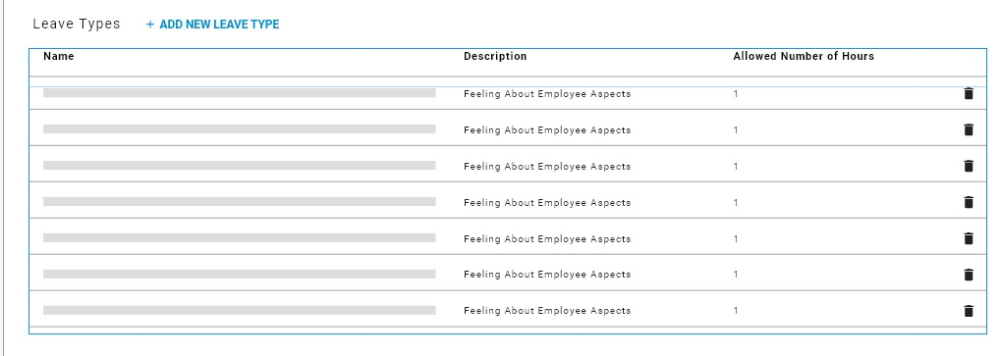

# Administration & Configuration

## Toolbar 

This is where you can access and manage the bellow fields. 

1. General
2. Designation
3. Exit Interview
4. Leave Policy
5. Global Pension Rate
6. Appraisal
7. Global Contract Configuration
8. Global Salary Tax Report Configurations
9. Salary Heads

### General 

This is where you can add, edit and delete the bellow fields.

1. Education Degree
2. Office
3. Department
4. Job Grades
5. Attendance Group
6. Profession
7. Qualification

To add any of them just click on add button and you can edit it by clicking on pen icon .

### Exit Interview

1. Add new question
2. Edit 
3. Delete

### Leave Policy

1. Add leave policy
2. Edit 
3. Delete

