# Administration & Configuration

The application provides the following functionality in configuration management panel.

1. [General](administration-and-configuration.md#general)
2. [Consumables](administration-and-configuration.md#consumables)
3. [Expendables](administration-and-configuration.md#expendable)
4. [Non-Expendables](administration-and-configuration.md#non-expendable)
5. Add
6. Edit

## General

This is where you can manage and add, Edit and delete the below fields.

1. [Unit types](administration-and-configuration.md#unit-types)
2. [Organization Source Codes](administration-and-configuration.md#organizations)
3. [Supplier Source Codes](administration-and-configuration.md#suppliers)
4. [Repair Shop Source Codes ](administration-and-configuration.md#repair-shops)
5. [Individual/Other Source Codes](administration-and-configuration.md#individual-others)
6. [Location/Store Source Codes](administration-and-configuration.md#locations-stores)

### Unit Types

To add a unit type clicking on the add button will appear a small page where you can type the unit name and, After adding the unit name, clicking on the save button the new unit type will be saved. then it will take you directly to the unit type overview page. On this page, you can be able to Edit and Remove the existen Unit Type.

  Clicking on this icon you can Edit any of Inventory Unit Types.

 You can use this button\(icon\) for delete\(remove\) any of Inventory Unit Types.

#### Unit Type Metadata

| Field | Data Type | Input Method | Notes |
| :--- | :--- | :--- | :--- |
| Unit Type | Text | Manual text input |  |

### Organizations

To add an Organization clicking on the add button, it will appear to you Organization add form where you can add all requests to the form.

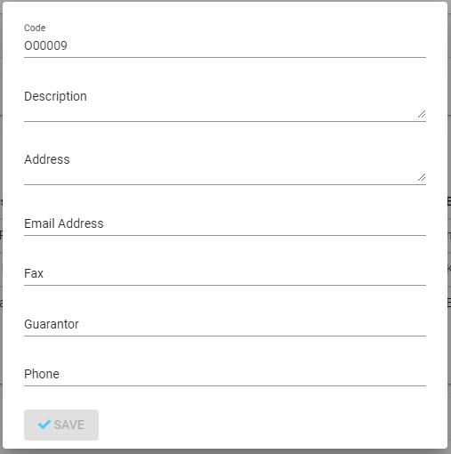

You need to fill all of the fields in the this form, then the Save button will be activated, by clicking the Save button. it will take you to the Organization overview details page.


Code field is automatically added by the system, and it cannot be edited.


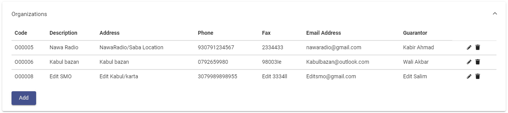

Here you can manage the Organization existen form, by clicking on the left side Edit and Delete button you can Edit and Remove every existen fields.

 Clicking on this icon you can Edit any of Inventory Organizations.

 You can use this button\(icon\) for delete\(remove\) any of Inventory Organizations.

#### Organization Metadata


This table specifies all the form fields. Mandatory fields end with a "\*" symbol.


| Field | Data Type | Input Method | Notes |
| :--- | :--- | :--- | :--- |
| Code | Code | functions |  |
| Description \* | Text\(Long\) | Manual text \(Long \)input |  |
| Address \* | Text | Manual text input |  |
| Email Address | Email Address | Manual text \(Long\) input |  |
| Fax | Fax | Manual text input |  |
| Guarantor | Text | Manual text input |  |
| Phone | Phone Number | Manual sequence input |  |

### Suppliers

To add an Supplier clicking on the add button, it will appear to you the form added requests.

You have to fill all of the fields in the this form, then the Save button will be activated, by clicking the Save button. it will take you to the Suppliers overview details page.


Code field is automatically added by the system, and it cannot be edited.


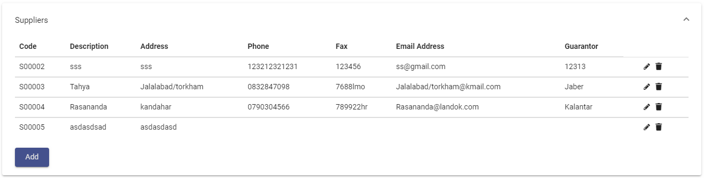

In the Suppliers Overview form you can be able to Edit and Remove the suppliers form. After clicking the edit button on the left side of the form, the add page will appear again with all the previously added details that you can change it.

 Clicking on this icon you can Edit any of Suppliers.

 You can use this button\(icon\) for delete\(remove\) any of Suppliers.

#### Suppliers Metadata


This table specifies all the form fields. Mandatory fields end with a "\*" symbol.


| Field | Data Type | Input Method | Notes |
| :--- | :--- | :--- | :--- |
| Code | Code | functions |  |
| Description \* | Text\(Long\) | Manual text \(Long\) input |  |
| Address \* | Text | Manual text input |  |
| Email Address | Email Address | Manual text \(Long\) input |  |
| Fax | Fax | Manual text input |  |
| Guarantor | Text | Manual text input |  |
| Phone | Phone Number | Manual sequence input |  |

### Repair Shops

To add an Repair Shops clicking on the add button, it will appear to you Repair Shops add form where you can add all requests to the form.

You have to fill all of the fields in the this form, then the Save button will be activated, by clicking the Save button. it will take you to the Repair Shops Overview page.


Code field is automatically added by the system, and it cannot be edited.


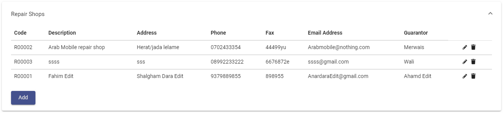

In the Overview for of Repair Shops you can manage the Repair Shop existen form, by clicking on the left side Edit and Delete button you can Edit and Remove every existen fields.

 Clicking on this icon you can Edit any of Repair shops.

 You can use this button\(icon\) for delete\(remove\) any of Repair shops.

#### Repair Shops Metadata


This table specifies all the form fields. Mandatory fields end with a "\*" symbol.


| Field | Data Type | input method | Notes |
| :--- | :--- | :--- | :--- |
| Code | Code | functions |  |
| Description \* | Text\(Long\) | Manual text \(Long\) input |  |
| Address \* | Text | Manual text input |  |
| Email Address | Email Address | Manual text \(Long\) input |  |
| Fax | Fax | Manual text input |  |
| Guarantor | Text | Manual text input |  |
| Phone | Phone Number | Manual sequence input |  |

### Individual/Others

You can add Individual Others by clicking on the add button and it will take you to the Individual Others add form.

You have to fill all of the fields in the this form, then the Save button will be activated, by clicking the Save button. it will take you to the Repair Shops Overview page.


Code field is automatically added by the system, and it cannot be edited.


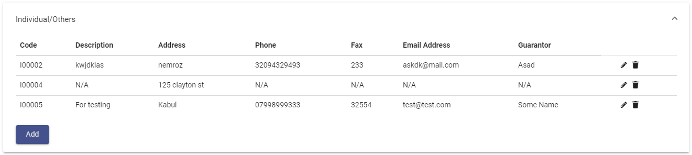

In the Individual Others Overview form you can be able to Edit and Remove the Individual Other form. After clicking the edit button on the left side of the form, the add page will appear again with all the previously added details that you can change it.

 Clicking on this icon you can Edit any of Inventory Other.

 You can use this button\(icon\) for delete\(remove\) any of Individual Other.

#### Individual Others Metadata


This table specifies all the form fields. Mandatory fields end with a "\*" symbol.


| Title | Data Type | Input Method | Notes |
| :--- | :--- | :--- | :--- |
| Code | Code | functions |  |
| Description \* | Text\(Long\) | Manual text \(Long\) input |  |
| Address \* | Text | Manual text input |  |
| Email Address | Email Address | Manual text \(Long\) input |  |
| Fax | Fax | Manual text input |  |
| Guarantor | Text | Manual text input |  |
| Phone | Phone Number | Manual sequence input |  |

### Locations/Stores

To add Location Store clicking on the add button it will appear the page where you can fill all of the fields in this form, 

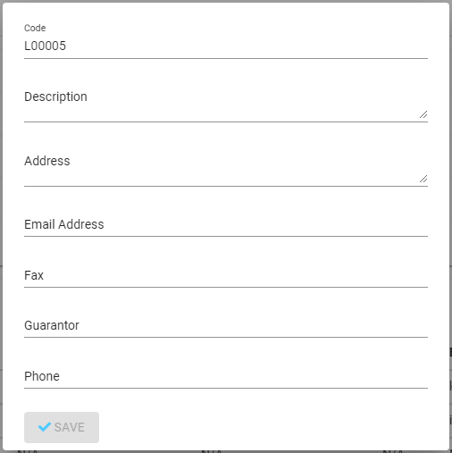

clicking on the save button the new Location Store will be saved. then it will take you directly to the Locations Stores overview page.


Code field is automatically added by the system, and it cannot be edited.


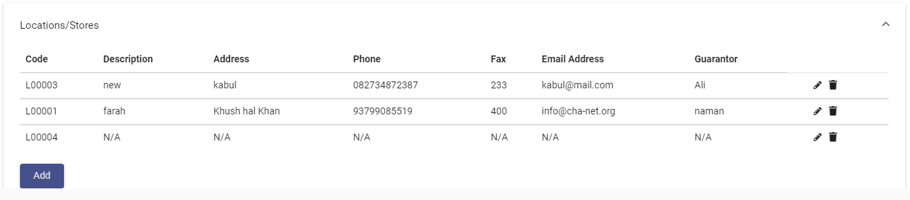

 On this page, you can be able to Edit and Remove the existen Locations Store forms.

 Clicking on this icon you can Edit any of Inventory Locations Store.

 You can use this button\(icon\) for delete\(remove\) any of Inventory Locations Store.

#### Locations Stores Metadata


This table specifies all the form fields. Mandatory fields end with a "\*" symbol.


| Field | Data Type | Input Method | Notes |
| :--- | :--- | :--- | :--- |
| Code | Code | functions |  |
| Description \* | Text\(Long\) | Manual text input |  |
| Address \* | Text | Manual text input |  |
| Email Address | Email Address | Manual text input |  |
| Fax | Fax | Manual text input |  |
| Guarantor | Text | Manual text input |  |
| Phone | Phone Number | Manual sequence input |  |

## Consumables

This is where you can add and edit consumable purchases in consumable there is three steps master inventory code, item category code and item code.

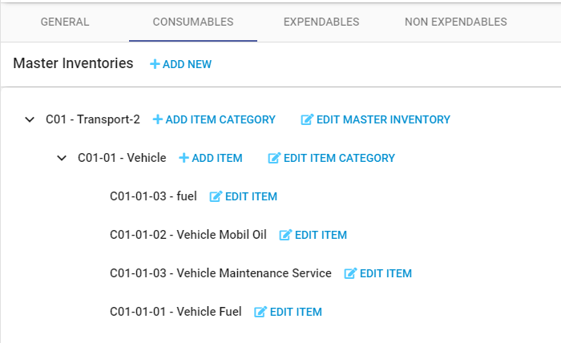

### Toolbar

In toolbar you can add master inventory code for the consumable purchases.

### Master Inventory

You can add Master Inventory by clicking on add button and a form will appear and you should provide below data in Master Inventory code of Consumable.

1. What is the name of the Master Inventory?
2. Please describe the Master Inventory.
3. Please select the account.
4. Is this a Transport related Master Inventory? Yes or No
5. Save 
6. Cancel

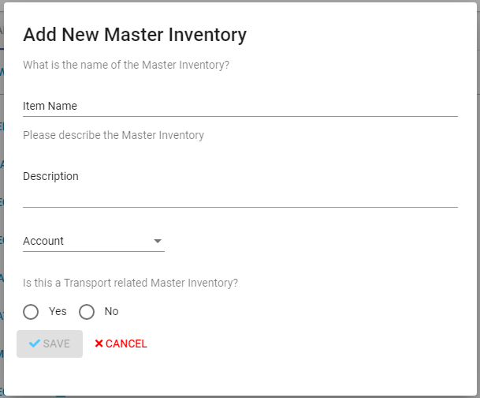

### Consumables Master Inventory Metadata

| Field | Data Type | input method | Notes |
| :--- | :--- | :--- | :--- |
| Item Name | Text | Manual text input |  |
| Description | Text\(Long\) | Manual text \(Long\) input |  |
| Account | Account | Drop-Down |  |
| Transport Related | Boolean | Yes/No |  |

### Item Category

You can add Item category by clicking on add button and a form will appear and you should provide below data in Item category code of Consumable.

1. What is the name of the Item Category?
2. Please describe the Item Category.
3. Please select the Transport category for this Item Category. 
4. Vehicle or Generator
5. Save button
6. Cancel button

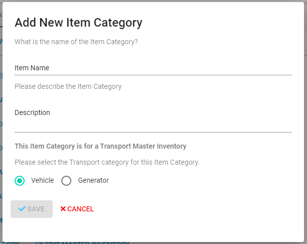

#### Consumables item Category Metadata

| Field | Data Type | input method | Notes |
| :--- | :--- | :--- | :--- |
| Item Name | Text | Manual text input |  |
| Description | Text\(Long\) | Manual text \(Long\) input |  |
| Transport Category |  checkmark  | Vehicle/Generator |  |

### Item Configuration

Clicking on add item you can add a new item by providing the below data in consumable.

1. What is the name of the Item?
2. Please describe the Item.
3. Please select the Vehicle Item Type for this Item.
4. Select Default Unit Type for Non Expendable purchase item
5. Save 
6. Cancel

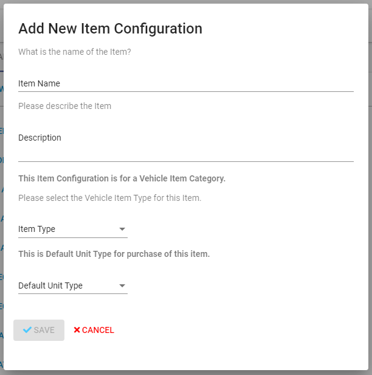

#### Consumables item configuration Metadata

| Field | Data Type | input method | Notes |
| :--- | :--- | :--- | :--- |
| Item Name | Text | Manual text input |  |
| Description | Text\(Long\) | Manual text \(Long\) input |  |
| Item Type | Item Type | Drop-Down |  |
| Default unit Type | Unit Type | Drop\_Down |  |

## Expendable

This is where you can add and edit Expendable Purchases in Expendable there is three steps Master inventory code, Item category code and Item code.

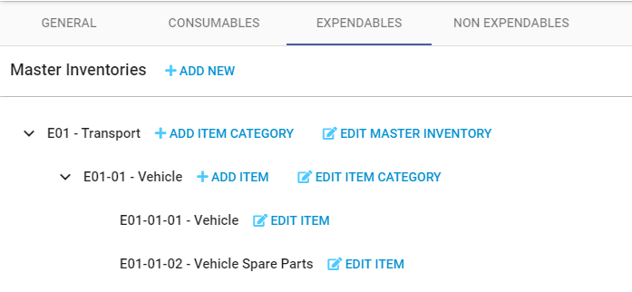

### Toolbar

From Toolbar section you can add master inventory code for the expendable purchases.

### Master Inventory

You can add Master Inventory by clicking on add button and a form will appear and you should provide below data in Master Inventory code of Expendable.

1. What is the name of the Master Inventory?
2. Please describe the Master Inventory.
3. Please select the account.
4. Is this a Transport related Master Inventory? 
5. Yes or No
6. Save 
7. Cancel

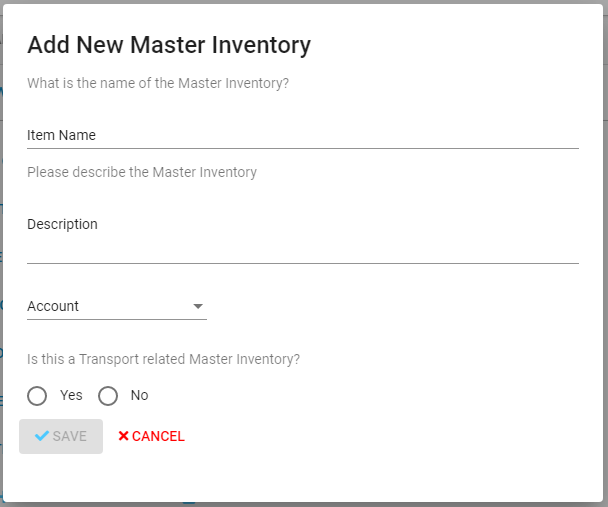

#### Expendable Master Inventory Metadata

| Field | Data Type | input method | Notes |
| :--- | :--- | :--- | :--- |
| Item Name | Text | Manual text input |  |
| Description | Text\(Long\) | Manual text \(Long\) input |  |
| Account | Account | Drop-Down |  |
| Transport Related | Boolean | Yes/No |  |

### Item Category

You can add Item category by clicking on add button and a form will appear and you should provide below data in Item category code of Expendable.

1. What is the name of the Item Category?
2. Please describe the Item Category.
3. Please select the Transport category for this Item Category. 
4. Vehicle or Generator
5. Save button
6. Cancel button

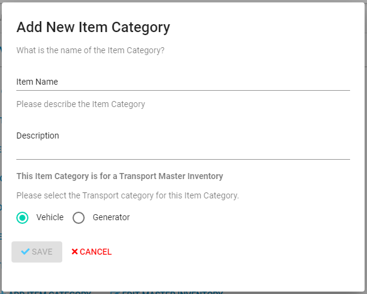

#### Expendable item Category Metadata

| Field | Data Type | input method | Notes |
| :--- | :--- | :--- | :--- |
| Item Name | Text | Manual text input |  |
| Description | Text\(Long\) | Manual text \(Long\) input |  |
| Transport Category |  checkmark  | Vehicle/Generator |  |

### Item Configuration

Clicking on add item you can add a new item by providing the below data in Expendable.

1. What is the name of the Item?
2. Please describe the Item.
3. Please select the Vehicle Item Type for this Item.
4. Select Default Unit Type for Non Expendable purchase item
5. Save 
6. Cancel

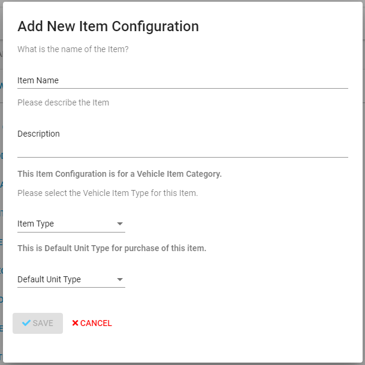

#### Expendable item Configuration Metadata

| Field | Data Type | input method | Notes |
| :--- | :--- | :--- | :--- |
| Item Name | Text | Manual text input |  |
| Description | Text\(Long\) | Manual text \(Long\) input |  |
| Item Type | Item Type | Drop-Down |  |
| Default unit Type | Unit Type | Drop\_Down |  |

## Non Expendable

This is where you can add and edit Non Expendable purchases there is three steps master inventory code, item category code and item code.

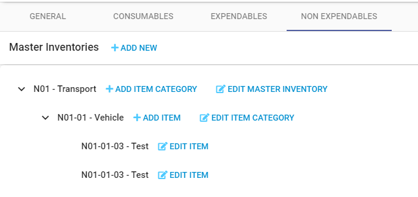

### Toolbar

* Add New Master Inventories

### Master inventory

You can add Master Inventory by clicking on add button and a form will appear and you should provide below data in Master Inventory code of Non Expendable.

1. What is the name of the Master Inventory?
2. Please describe the Master Inventory.
3. Please select the account.
4. Is this a Transport related Master Inventory? 
5. Yes or No
6. Save 
7. Cancel

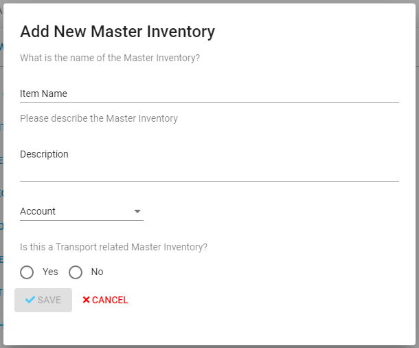

#### Non Expendable Master Inventory Metadata

| Field | Data Type | input method | Notes |
| :--- | :--- | :--- | :--- |
| Item Name | Text | Manual text input |  |
| Description | Text\(Long\) | Manual text \(Long\) input |  |
| Account | Account | Drop-Down |  |
| Transport Related | Boolean | Yes/No |  |

### Item Category

You can add Item category by clicking on add button and a form will appear and you should provide below data in Item category code of Non Expendable.

1. What is the name of the Item Category?
2. Please describe the Item Category.
3. Please select the Transport category for this Item Category. 
4. Vehicle or Generator
5. Save button
6. Cancel button

#### Non Expendable Item Category

| Field | Data Type | input method | Notes |
| :--- | :--- | :--- | :--- |
| Item Name | Text | Manual text input |  |
| Description | Text\(Long\) | Manual text \(Long\) input |  |
| Transport Category |  checkmark  | Vehicle/Generator |  |

### Item Configuration

Clicking on add item you can add a new item by providing the below data in Non Expendable.

1. What is the name of the Item?
2. Please describe the Item.
3. Please select the Vehicle Item Type for this Item.
4. Select Default Unit Type for Non Expendable purchase item
5. Save 
6. Cancel

#### Non Expendable item Configuration Metadata

| Field | Data Type | input method | Notes |
| :--- | :--- | :--- | :--- |
| Item Name | Text | Manual text input |  |
| Description | Text\(Long\) | Manual text \(Long\) input |  |
| Item Type | Item Type | Drop-Down |  |
| Default unit Type | Unit Type | Drop\_Down |  |

