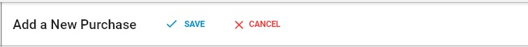
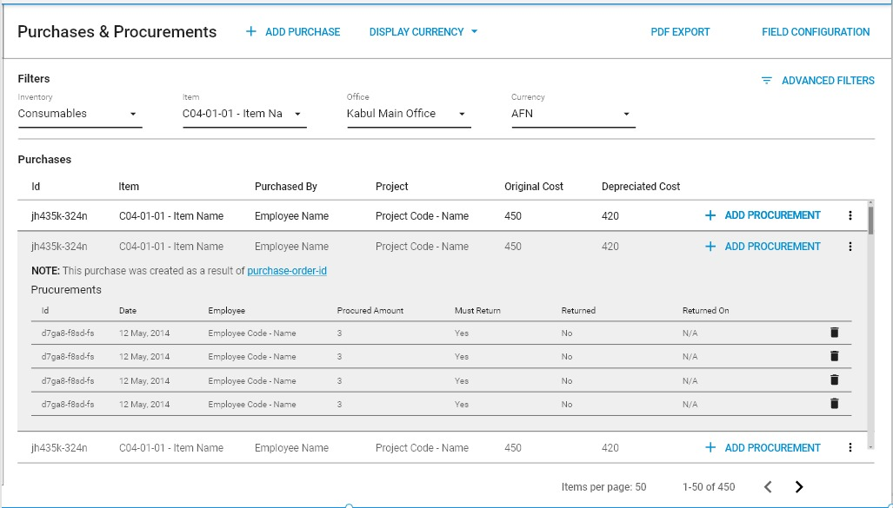

# Purchases & Procurements

### Overview

1. Toolbar
2. Purchase procurements operation control panel 
3. Add a New Purchase procurement control panel 
4. Adding purchase
5. Editing purchase
6. Export PDF
7. Advanced Filter

### Toolbar

The Toolbar is a section of the interface that provides users with control options for running actions on Purchase procurement.

Toolbar in purchase procurement operations control penal allows the following actions:

1. Add purchase 
2. Display currency 
3. PDF export 
4. Field configuration

The Toolbar for the Purchase Procurement control panel currently allows the following actions:

1. Save 
2. Cancel

### Purchase procurement operations control panel

You can access to the Purchase procurement operations control panel by clicking on store section.

This is where you can see all currently Purchase Procurements. Clicking on the listing entry of any Parchases will take you to the Add New Purchase control panel for the specific Purchase you clicked on.

You can also add new Purchase and search exciting purchases by clicking on Advanced Filters you can search specifics purchases.

You can also Add Procurement for the every purchases by clicking on the add procurement in the list.

#### Add Purchase

By clicking on add Purchase will take you to the Add a New Purchase form where you can fill required data for the new purchase.

#### PDF Export

By clicking on PDF Export it will download a PDF format of the selected fields of the Field Configuration.

#### Field configuration

This is where you can select a specific fields to see them in PDF Export and also the selected fields will appear in the list.

### Add a New Purchase procurement control panel

#### Toolbar

1. Save 
2. Cancel

### Adding a New Purchase

You can add a new purchase by navigating to the **Purchase procurement Operations Control Panel** and clicking the **ADD Purchase** button. Doing this will navigate you to the Add a New Purchase form where you will be required to provide information about the new purchase.

#### Expendable

#### Consumable

#### Non- Expendable

* Vehicle 
* Generator

#### Documents

### Procurement Control Panel

#### Procurement Details

### Adding a Procurement

### Editing a Procurement

