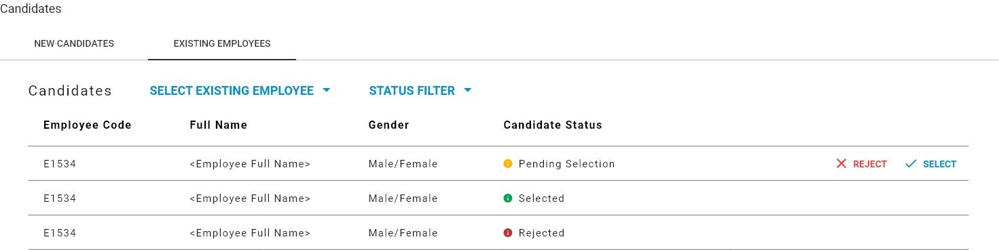
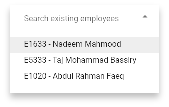

# Current Candidate Requests

Existing Employees can be managed as candidates for the hiring request under the **Existing Employees** tab. This tab provides a listing of all existing employees that have been added as a candidate for the hiring request. All other control functionality needed for managing existing employees as candidates for the hiring request can be found here.

In order to add an existing employee as a candidate for a hiring request, first click the **Select Existing Employee** dropdown button. This will drop down a list of employees that can be selected. You can search for the employee you're looking for by typing their name or code. The list of employees in the list will update as you type.

After you find the employee you're looking for, click it and that employee will be added as a candidate. The new candidate should appear in the list as soon as it is successfully registered on the server.


By default only candidates that are **NOT Selected** or **Rejected** will be displayed, but the **Status Filter** can be used to view candidates from any **Status.**


At this point the candidate can selected or rejected by pressing the **Select** or **Reject** buttons in their listing entry.

Pressing either button will mark the end of their selection process and their status will be updated to show if they were **Selected** or **Rejected**. This action is **non-reversible**.

  

After this stage, typically HR department users in the organization will manually update the Analytical Info for this employee. This is needed to keep up data integrity with Payroll.

Candidates can be added to a hiring request as long as it is active and has open vacancies. Once a hiring request is Archived, users can no longer manage candidates or process them.

