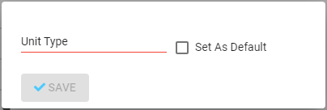

# Hiring Request Management

This document is both a specification and a guide to managing hiring requests. The application provides the following functionality that handles Hiring Request management:

1. [Toolbar](hiring-request-management.md#toolbar)
2. [Hiring Operations Control Panel](hiring-request-management.md#hiring-operations-control-panel)  
3. [Hiring Request Control Panel](hiring-request-management.md#hiring-request-control-panel)
4. [Adding Hiring Requests](hiring-request-management.md#adding-a-hiring-request)
5. [Editing Hiring Requests](hiring-request-management.md#editing-a-hiring-request)
6. [PDF Export](hiring-request-management.md#pdf-export)

## Toolbar

The Toolbar is a section of the interface that provides users with control options for running actions on Hiring Requests. 

The Toolbar for the [Hiring Operations Control Panel](hiring-request-management.md#hiring-operations-control-panel) currently  allows the following actions:

1. [Adding new Hiring Request](hiring-request-management.md#adding-a-hiring-request)
2. Completing a selection of Hiring Requests
3. Closing a selection of Hiring Requests

The Toolbar for the [Hiring Request Control Panel](hiring-request-management.md#interface-overview) currently allows the following actions:

1. [Edit](hiring-request-management.md#editing-a-hiring-request)
2. [Complete](hiring-request-management.md#archived-requests)
3. [Close](hiring-request-management.md#archived-requests)
4. [PDF Export](hiring-request-management.md#pdf-export)

## Hiring Operations Control Panel

Every project has a dedicated control panel for all of its Hiring Requests - the **Hiring Operations Panel**. You can access this control panel by clicking the **HIRING** button in the Project \(Details\) Management tab panel.

This is where you can see all currently active Hiring Requests for the given Project. Each Project has its own list of Hiring Requests. Clicking on the listing entry of any Hiring Request will take you to the [Hiring Request Control Panel](hiring-request-management.md#hiring-request-control-panel) for the specific Request you clicked on.

You can also [Add new Hiring Requests](hiring-request-management.md#adding-a-hiring-request) and [Complete or Close](hiring-request-management.md#archived-requests) a selected set \(from the list\) of Hiring Requests from the [Toolbar](hiring-request-management.md#toolbar).

### Archived Requests

Completed or Closed Hiring Requests are considered to be **Archived.** All Archived Hiring Requests can only be accessed from a separate tab than Active Hiring Requests. This reduces clutter in Hiring Requests listing and optimizes load times. Archived requests can be found under the **ARCHIVED** tab in the Hiring Operation Panel.

Once a Hiring Request is Archived, users can no longer add or select Candidates for it and editing is disabled.

This is an audit event and will trigger notifications.

## Hiring Request Control Panel

### Interface Overview

The interface consists of:

1. [Toolbar](hiring-request-management.md#toolbar)
2. [All Metadata Reference Pane](hiring-request-management.md#all-metadata-reference-pane) which includes [Code](hiring-request-management.md#code)
3. [Candidate Management Pane](hiring-request-management.md#candidates)

### Code

Code is an automatically generated and system maintained value for every Hiring Request. It is a string of alphanumeric text that follows a specific pattern. The pattern contains the text "HR-" followed by a number which represents the sequence in which the Hiring Request was added/created for that specific project. Every project will have a unique sequence for the number part which starts with 1.

The following examples of codes considers two projects exist for the organization and each one has four hiring requests.

Project 1

`HR-1 <- First hiring request for project 1  
HR-2 <- Second hiring request for project 1  
HR-3 <- Third hiring request for project 1  
HR-4 <- Fourth hiring request for project 1`

Project 2

`HR-1 <- First hiring request for project 2  
HR-2 <- Second hiring request for project 2  
HR-3 <- Third hiring request for project 2  
HR-4 <- Fourth hiring request for project 2`

### All Metadata Reference Pane

This is a specific section that presents all entity and process metadata to users. Hiring Requests, this section will present.

| Field | Description |
| :--- | :--- |
| Specific Duties & Responsibilities | Text\(long\) |
| Submission Guidelines | Text\(long\) |
| Duty Station | [Office](../../hr-panel/hr-configuration-operation/office-configuration.md) |
| Position | [Designation](../../finance/accounting-operation/designation-page.md) |
| Budget Line | [Budget Line](../project-budget-line-management-cantrol-panel.md#budget-line-code) |
| Total Vacancies | Integer number |
| Current Vacancies | Integer number |
| Announcing Date | Date |
| Closing Date | Date |
| Contract Type | Contract Type |
| Contract Duration \(in Months\) | Integer number |
| Job Grade | [Job Grade](../../hr-panel/hr-configuration-operation/#general) |
| Job Shift | Shift |
| Job Type | [Department](../../hr-panel/hr-configuration-operation/office-configuration.md#add-department) |
| Pay Currency | Currency |
| Pay Hourly Rate | Decimal number |
| Knowledge & Skills | Text\(long\) |
| Education Degree | [Education](../../hr-panel/hr-configuration-operation/#general) |
| Profession | [Profession](../../hr-panel/hr-configuration-operation/#general) |
| Experience \(in Years\) | Decimal number |
| Nationality | [Country](../../common/api-and-data-structure.md#get-countries) |
| Province | [Province](../../common/api-and-data-structure.md#get-provinces) |
| Background | Text\(long\) |

### Candidate Management

Candidates are Requests for or from people to be selected for a specific Hiring Request. Hiring Requests currently provide management and processing tools for:





The hiring request panel has a section labelled as **Candidate Management** for the **Candidate Management Panel**. This panel contains dedicated tabs for the management tools and functionality of the select Candidate types. Each tab contains a listing and UI controls for managing that type of candidate and performing standard operations on them.

## Adding a Hiring Request

You can add a new hiring request by navigating to the **Hiring Operations Control Panel** and clicking the **ADD** button. Doing this will navigate you to the hiring request form where you will be required to provide information about the new hiring request.

This is what the form looks like within the application.

Many of the fields are mandatory or have some sort of validation or rule applied to them. Please see the set of metadata fields specified [here]() for the exact information that users can provide for a Hiring Request.

| Field | Data Type | Section | Notes |
| :--- | :--- | :--- | :--- |
| Specific Duties & Responsibilities | Text\(long\) | General Information |  |
| Submission Guidelines | Text\(long\) | General Information |  |
| Duty Station | [Office](../../hr-panel/hr-configuration-operation/office-configuration.md) | General Information |  |
| Position | [Designation](../../finance/accounting-operation/designation-page.md) | General Information |  |
| Budget Line | [Budget Line](../project-budget-line-management-cantrol-panel.md) | General Information |  |
| Total Vacancies | Integer number | General Information |  |
| Current Vacancies | Integer number |  |  |
| Announcing Date | Date | General Information |  |
| Closing Date | Date | General Information |  |
| Contract Type | Contract Type | Contract Information |  |
| Contract Duration \(in Months\) | Integer number | Contract Information |  |
| Job Grade | [Job Grade](../../hr-panel/hr-configuration-operation/#general) | Contract Information |  |
| Job Shift | Shift | Contract Information | Options are \[day, night\] |
| Job Type | [Department](../../hr-panel/hr-configuration-operation/office-configuration.md#add-department) | Contract Information |  |
| Pay Currency | Currency | Contract Information |  |
| Pay Hourly Rate | Decimal number | Contract Information |  |
| Knowledge & Skills | Text\(long\) | Required Qualifications |  |
| Education Degree | [Education](../../hr-panel/hr-configuration-operation/#general) | Required Qualifications |  |
| Profession | [Profession](../../hr-panel/hr-configuration-operation/#general) | Required Qualifications |  |
| Experience \(in Years\) | Decimal number | Required Qualifications |  |
| Nationality | [Country](../../common/api-and-data-structure.md#get-countries) | Required Qualifications |  |
| Province | [Province](../../common/api-and-data-structure.md#get-provinces) | Required Qualifications | Options are cascaded based on selected Nationality |
| Background | Text\(long\) | Required Qualifications |  |

As soon as a new hiring request is **successfully** added, you will be redirected back to the active hiring requests page. The new hiring request will now be available in the listing. Please click an entry in the listing to go to the **Hiring Request Panel** for that request. This is where you can perform actions specific to a hiring request such as managing its candidates.

1. It will not be possible to select values for Budget Line, Office, Department \(Job Type field in the form\), Designation\(Position field in the form\), Pay Currency, Education Degree, or Profession if system administrators have not first created them in their respective configuration pages.
2. Pagination only allows 50 entries at a time and users always land on the first page when visiting the hiring requests list. If there are more than 50 hiring requests, the new hiring request might not appear in the first page.

## Editing a Hiring Request

From the Hiring Request Details panel, users can use the Edit button and that will redirect them to the hiring request form \(the same form that was used for adding a new hiring request\) with all the current details filled in.

By default, the save button will be disabled and grayed out when editing. If any changes are made to values then the button will be enabled.

Making changes to fields are not going to be reflected to objects that had previously been created on behalf of the Hiring Request. For example, editing the Contract Type for a Hiring Request will not automatically update the contract type for employees that had already been selected **before** the edit action.

| Field | Data Type | Input Method | Section | Notes |
| :--- | :--- | :--- | :--- | :--- |
| Specific Duties & Responsibilities | Text\(long\) | Manual text input | General Information |  |
| Submission Guidelines | Text\(long\) | Manual text input | General Information |  |
| Duty Station | [Office](../../hr-panel/hr-configuration-operation/office-configuration.md) | Dropdown | General Information | **LOCKED ON EDIT** |
| Position | [Designation](../../finance/accounting-operation/designation-page.md) | Dropdown | General Information | **LOCKED ON EDIT** |
| Budget Line | [Budget Line](../project-budget-line-management-cantrol-panel.md) | Dropdown | General Information | **LOCKED ON EDIT** |
| Total Vacancies | Integer number | Manual numeric input | General Information | **LOCKED ON EDIT** |
| Announcing Date | Date | Calendar date selection | General Information |  |
| Closing Date | Date | Calendar date selection | General Information |  |
| Contract Type | Contract Type | Dropdown | Contract Information | **LOCKED ON EDIT** |
| Contract Duration \(in Months\) | Integer number | Manual numeric input | Contract Information | **LOCKED ON EDIT** |
| Job Grade | [Job Grade](../../hr-panel/hr-configuration-operation/#general) | Dropdown | Contract Information | **LOCKED ON EDIT** |
| Job Shift | Shift | Dropdown | Contract Information | Options are day, night. |
| Job Type | [Department](../../hr-panel/hr-configuration-operation/office-configuration.md#add-department) | Dropdown | Contract Information | **LOCKED ON EDIT** |
| Pay Currency | Currency | Dropdown | Contract Information | **LOCKED ON EDIT** |
| Pay Hourly Rate | Decimal number | Manual numeric input | Contract Information |  |
| Knowledge & Skills | Text\(long\) | Dropdown | Required Qualifications |  |
| Education Degree | [Education](../../hr-panel/hr-configuration-operation/#general) | Dropdown | Required Qualifications | **LOCKED ON EDIT** |
| Profession | [Profession](../../hr-panel/hr-configuration-operation/#general) | Dropdown | Required Qualifications | **LOCKED ON EDIT** |
| Experience \(in Years\) | Decimal number | Manual numeric input | Required Qualifications |  |
| Nationality | [Country](../../common/api-and-data-structure.md#get-countries) | Dropdown | Required Qualifications | **LOCKED ON EDIT** |
| Province | [Province](../../common/api-and-data-structure.md#get-provinces) | Dropdown | Required Qualifications | **LOCKED ON EDIT** |
| Background | Text\(long\) | Dropdown | Required Qualifications |  |

## PDF Export

You can download this by going to the details panel for a Hiring Request and clicking the **PDF EXPORT** button at the **toolbar**. This can be found at the top of the panel.

[This document](http://../documents/Hiring&#32;request&#32;form.doc) specifies the template that the exported PDF document will follow. Following is an additional list of rules and specifications that this document must follow:

1. The **Vacancy Number/Hiring Request ID** field must show the Code for the Hiring Request.
2. The **No.jobs/Vacancies \(Job Availability\)** field must show the value that was set for **Total Vacancies** in the Hiring Request.
3. The **Job Status** field must show the current status of the hiring request.
4. As a result of inherent data structure differences between this application and the old application that the organization uses, the fields Province, Nationality, and Background cannot be included in this PDF export. This information is inherent to the candidates that apply or applied for the hiring request and can be found in their details.
5. Since this application's payroll system follows an hourly rate system and is supposed to update details for selected candidates automatically, the **Salary Range** field cannot be supported and has been replaced by **Hourly Rate** and **Hourly Rate Currency** fields.

