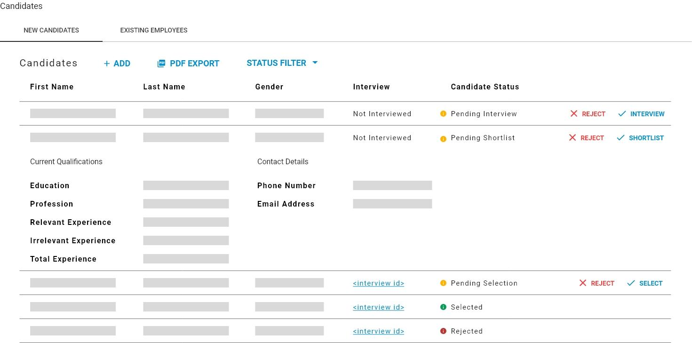
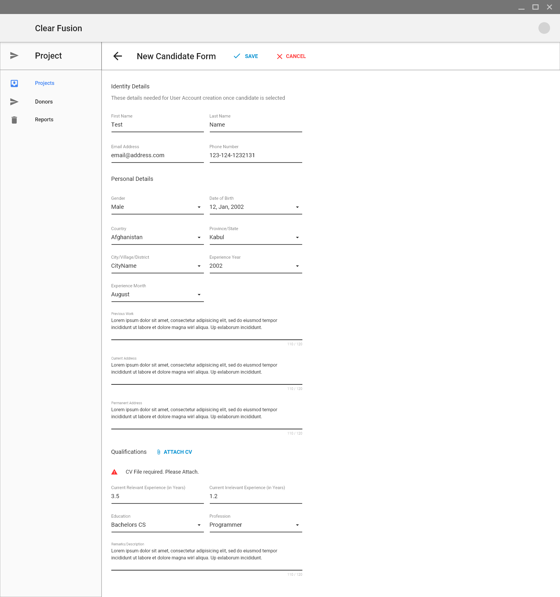
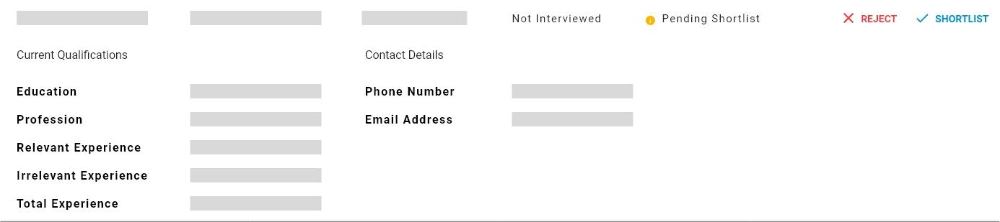

# New Candidate Requests

## New Candidates Panel

Every Hiring Request has a unique list of New Candidates that can be managed by this panel. You can create new New Candidate Requests and perform any of the following operations on them:

1. Shortlist
2. Interview
3. Select
4. Reject \(at any time\)


By default only candidates that are **NOT Selected** or **Rejected** will be displayed, but the **Status Filter** can be used to view candidates from any **Status.**


## Adding New Candidate Requests

New Candidates can be managed under the **New Candidates** tab. This tab provides a listing that allows users to view the details of all existing new candidates and all other control functionality needed for managing new candidates.

In order to add a new candidate for a hiring request, first click the **Add** button. This will direct you to the following form that needs to be filled out. Please see [here]() for detailed specification on how this form works.

After you fill in the form click save and the new candidate will be registered to the server. If the new candidate was successfully added you will be redirected back to the hiring request detail. The new candidate will now appear in the Candidates list and you can begin processing it.

1. The New Candidates list is a expandable/collapsible list. Clicking on an entry in the list will expand it to show the full details of the candidate. Clicking on another entry in the list \(after having expanded one already\) will collapse the previously expanded entry and expand the new one. By default, all entries in the list will start out as collapsed.
2. New Candidates cannot be edited.

### New Candidate Fields

Adding a New Candidate requires users to fill out all of these fields:


All these fields are mandatory.


| Field | Description | Input Method | Notes |
| :--- | :--- | :--- | :--- |
| Code | [Hiring Request Code](../hiring-request-management.md#code) | Manual text input |  |
| Status | Current Workflow State | Manual text input |  |
| Duty Station | [Office](../../../hr-module/hr-configuration-operation/office-configuration.md#office-configuration-tab) | Drop-down |  |
| First Name | Text | Manual text input |  |
| Last Name | Text | Manual text input |  |
| Gender | Gender | Dropdown |  |
| Phone | Phone Number | Manual sequence input |  |
| Email | Email Address | Manual email input | Options are cascaded from Country selection |
| Date of Birth | Date | Manual date input | Options are cascaded from Province/State selection |
| Country | [Country](http://../common-data-structures) | Drop-down |  |
| Province/State | [Province/State](http://../common-data-structures) | Drop-down |  |
| City/Village/District | [District](http://../common-data-structures) | Drop-down |  |
| Experience Year | Year | Calendar year selection |  |
| Experience Month | Month  | Calendar month selection |  |
| Previous Work | Text\(long\) | Manual text entry |  |
| Current Address | Text\(long\) | Manual text entry |  |
| Permanent Address | Text\(long\) | Manual text entry |  |
| CV Document | File | Local File upload |  |
| Current Experience - Relevant \(in Years\) | Decimal Number | Manual numeric input |  |
| Current Experience - Irrelevant \(in Years\) | Decimal Number | Manual numeric input |  |
| Education | [Education Degree](http://../common-data-structures) | Dropdown |  |
| Profession | [Profession](http://../common-data-structures) | Dropdown |  |
| Remarks/Description | Text\(long\) | Manual text input |  |

## **Shortlisting Candidates**

New Candidates need to go through a few extra steps than Existing Employee candidates before they can be selected for a hiring request. Namely **Shortlisting** and **Interviewing**. After the interview step they are up for **Selection**.

Just after adding a New Candidate their status will be **Pending Shortlist**.

This means that they can be shortlisted and this is done by pressing the **SHORTLIST** button in their listing entry. Once this is done, the candidate's status will be updated to **Pending Interview**. 

### Shortlist PDF Export

You can download this by going to the **New Candidates** tab in the **Candidate Management Panel** within the details panel for a Hiring Request. See below screenshot:

Once there, click the **PDF EXPORT** button and this will begin downloading the PDF document.

[This document](http://../documents/Short&#32;list&#32;format.xlsx) specifies the template that the exported PDF document will follow. Only shortlisted candidates will be presented in this document.

## Interviewing Candidates

Candidates that are **Pending Interview** will have an **INTERVIEW** button in their listing entry.

Pressing the **INTERVIEW** button will direct you to the **Interview Form**. Please visit the Interviews page for instructions on how to use Interviews.



Please 

## Selecting Candidates

The new candidate can now be selected by pressing the **SELECT** button in their listing entry which will update their status to Selected and a new employee with a corresponding user account will be automatically generated for the newly selected candidate. This action is **non-reversible**.

1. Technical Questions in the Interview are populated from the Technical Sepcification created for the Position/Designation that was selected in the Hiring Request. See [here](http://../common-data-structures#designation) for configuration on Designations and their Technical Questions/Specification.
2. At any point before selection, any candidate can be rejected if they don't meet qualifications. This will update their status to Rejected and you will not be able to perform any more actions on that candidate. This action is **non-reversible**.

