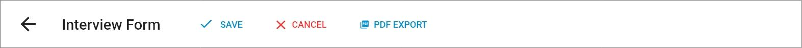

# Interviews

## Overview

Each interview has dedication functionality for all the following interview components:

1. [Metadata reference pane](./#metadata-reference-pane)
2. [Criteria Based Rating/Evaluation](./#criteria-based-evaluation)
3. [Technical Questions](./#technical-questions)
4. [Languages](./#languages)
5. [Training](./#training)
6. [Interview Form](./#interview-form)
7. [Total Score](./#total-score)
8. [Interviewers](./#interviewers)
9. [Recommendations/Outcome](./#recommendations-outcome-workflow)
10. [PDF Export](./#pdf-export)

This document clarifies **how each component works, what it's purpose is, and how you can use or interact with it**.

You can only interact with Interviews once you have a Hiring Request and a Shortlisted **New Candidate**. Please create one of these before carrying on with this document.

Go here if you don't have a Hiring Request yet.



Go here if you have a Hiring Request but no **New Candidates**.



If you have all of these, you can carry on with the Interview.

## Toolbar

### PDF Export

Once you have created an Interview for a Candidate, you will be able to create a PDF document that automatically prints all the details of the Interview within a structured document. You can download this by going to the Interview form and clicking the **PDF EXPORT** button at the toolbar.

[This document](http://../documents/Oral&#32;Interview&#32;Form.docx) specifies the template that the exported PDF document will follow.


You can not download this document before the Interview is added for the first time. Meaning that you need to save the Interview for the Candidate at least once and then go back to the Interview form.


## Metadata Reference Pane

## Interviewers

## Criteria Based Evaluation

## Technical Questions

This questions section within the Interview Form will present questions that are listed as Technical Questions for the Hiring Request's Position/Designation.

## Languages

## Training

## Interview Form

Once all the necessary information is filled out in the form, press the **Save** button at the top to submit it. Once the interview is saved and registered successfully, you will be redirected back to the hiring request details.

Typically a group of new candidates are shortlisted before they get interviewed.

After interview submission, the status of the candidate for which the interview was submitted will be updated to **Pending Selection**. There will also be a link to the interview details provided in the Interview column of the list. You can use this to go back and update the details of the interview at any time before selecting the employee.

## Total Score

## Recommendations/Outcome/Workflow

